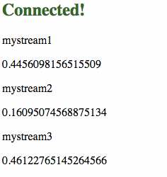

# shoe reconnect-core and mux-demux example.

A simple example that uses [shoe](http://github.com/substack/shoe) for websockets 
and [reconnect-core](https://github.com/juliangruber/reconnect-core) to keep the connection alive.

Multiple streams of data are used but only one websocket is used (thanks to [mux-demux](https://github.com/dominictarr/mux-demux))

## Install

Clone de repository and type

	npm install
	node index

**This starts a server on port 7777**

## Reconnect

Stop the node process, a "disconnected" message will be displayed every few seconds.
When you re start the server the browser reconnects and continues displaying data.

## Using multiple streams but just one websocket connection (With mux-demux)

[mux-demux](https://github.com/dominictarr/mux-demux) basically does this:

## Build

If you modify browser.js and want to recompile, use:

	npm run build

License: MIT
